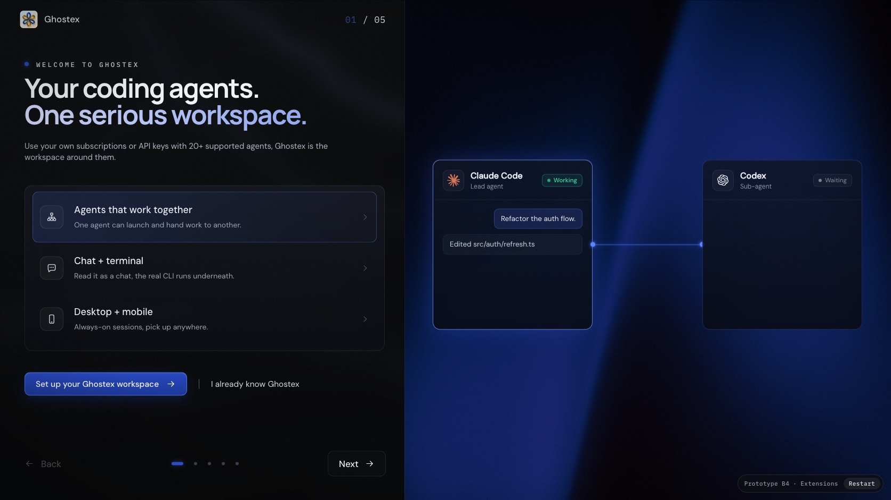
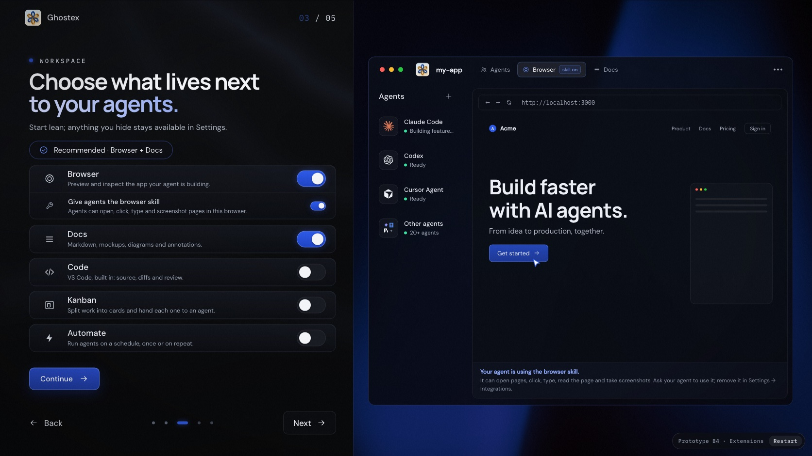

# Ghostex onboarding

The first-run flow a new [Ghostex](https://github.com/maddada/Ghostex) user walks through before the app opens. I designed it and built the clickable prototypes; the onboarding Ghostex ships today was built from them.

**▶ [Try it live](https://banozz0.github.io/ghostex-onboarding-prototypes/)**. Click through it the way a new user would.



## What it does

Five panels, from welcome to the first project:

1. **Welcome.** What Ghostex is, shown as short live demos instead of paragraphs.
2. **Agents.** Finds the agent CLIs you already have and connects them.
3. **Workspace.** Pick what sits next to your agents: Browser, Docs, Code, Kanban, Automate.
4. **Mobile.** Pair your phone and pick up a session anywhere.
5. **First project.** Open a folder and start with the agent you chose.



## How it got here

Six versions: three first directions, then three rounds on the one that won. Every one of them is still clickable on the [hub](https://banozz0.github.io/ghostex-onboarding-prototypes/hub.html).

| Version | The idea |
| :-- | :-- |
| **B4 · Extensions** | Extension switches back on the tiles, with a live preview beside each panel. **Current.** |
| B3 · Preview | Every extension tile opens a popup that previews it. Dropped after review. |
| B2 · Focused | Cut to five panels and one sentence per row; the panels react to what you pick. |
| A · Clean shader | Ported 1:1 from the first mockups: static light, real app windows. |
| B · Tone down | Rebuilt from the mockup PNGs: animated nebula, node diagrams, devices. |
| C · Clean blue | The original concept in plain HTML: vertical slides, blue grid glow. |

## Built with

React 19 and Bun. Each version is bundled into one self-contained HTML file: fonts and images are inlined, so it opens with a double-click and needs no server. The animated backgrounds are hand-written WebGL shaders. Every React version has a Playwright check that clicks through it and asserts what should happen: 149 checks in all.

```sh
bun install
bun run dev                        # http://localhost:5178, rebuilds and reloads on save
bun run build                      # dist/
bunx playwright install chromium-headless-shell   # once, for the checks
node src/b4-extensions/check.mjs   # prints PASS/FAIL per check
```

Source lives in `src/`, one folder per version; the original mockups sit next to the version built from them.
